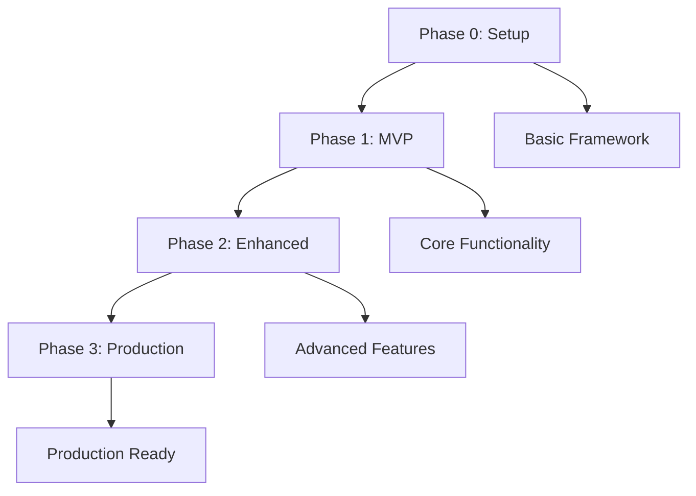

# BrainLift Generator - Development Phases

## Overview

This directory contains the iterative development plan for the BrainLift Generator project, organized into three progressive phases that build from a basic setup to a production-ready application.

## Phase Structure

Each phase is designed to deliver a functional product that builds upon the previous phase, following these principles:

- **Iterative Development**: Each phase enhances a working product
- **Functional Deliverables**: Every phase results in a usable application
- **Clear Scope**: Well-defined features and success criteria
- **Actionable Tasks**: Maximum 5 steps per feature for clear implementation

## Development Phases

### [Phase 0: Barebones Setup](./phase-0-setup.md)
**Goal**: Create a launchable Electron desktop application with basic framework

**Duration**: 2-3 weeks  
**Team Size**: 1-2 developers

**Key Deliverables**:
- Functional Electron application with React frontend
- Secure main process with proper IPC communication
- Basic UI components following design system
- Development environment and build pipeline
- Project structure following AI-first conventions

**Success Criteria**: Application launches, displays basic interface, and can be built for distribution

---

### [Phase 1: Minimum Viable Product (MVP)](./phase-1-mvp.md)
**Goal**: Functional BrainLift document generation with core workflow

**Duration**: 6-8 weeks  
**Team Size**: 2-3 developers

**Key Deliverables**:
- Interactive Purpose definition with AI chat interface
- Automated parallel research workflows (Experts, SpikyPOVs, Knowledge Tree)
- Document review and editing functionality
- Firebase integration for document persistence
- File system integration for saving to project directories

**Success Criteria**: Users can complete end-to-end BrainLift creation and save documents

---

### [Phase 2: Enhanced Features](./phase-2-enhanced-features.md)
**Goal**: Advanced features and improved user experience

**Duration**: 8-10 weeks  
**Team Size**: 3-4 developers

**Key Deliverables**:
- Advanced research quality controls and customization
- Multi-document workflow management
- Intelligent content enhancement with AI suggestions
- Advanced UI interactions and keyboard shortcuts
- Performance optimizations and analytics dashboard

**Success Criteria**: Users report significantly improved productivity and satisfaction

---

### [Phase 3: Polish and Scale](./phase-3-polish-and-scale.md)
**Goal**: Production-ready application with enterprise-grade quality

**Duration**: 6-8 weeks  
**Team Size**: 4-5 developers + QA

**Key Deliverables**:
- Professional-grade UI/UX with pixel-perfect design
- Enterprise-level performance and scalability
- Comprehensive testing and quality assurance
- Production deployment pipeline with automated updates
- Complete documentation and user onboarding

**Success Criteria**: Application meets professional software standards and is ready for broad distribution

## Development Timeline

```
Phase 0: Setup           [Weeks 1-3]     ████████
Phase 1: MVP            [Weeks 4-11]    ████████████████████████
Phase 2: Enhanced       [Weeks 12-21]   ████████████████████████████
Phase 3: Polish         [Weeks 22-29]   ████████████████████
                                         
Total Duration: ~7-8 months
```

## Key Milestones

### Phase 0 Completion
- [x] Electron application launches successfully
- [x] Basic UI framework operational
- [x] Development environment fully configured
- [x] Security configuration validated

### Phase 1 Completion (MVP)
- [x] Complete BrainLift creation workflow functional
- [x] All three research workflows operational
- [x] Document persistence and file saving working
- [x] Basic error handling and progress tracking

### Phase 2 Completion (Enhanced)
- [x] Advanced features significantly improve user experience
- [x] Multi-document management operational
- [x] Performance optimizations measurably improve speed
- [x] Analytics provide actionable user insights

### Phase 3 Completion (Production)
- [x] Professional-grade quality achieved
- [x] Enterprise-level performance and reliability
- [x] Comprehensive testing and documentation complete
- [x] Production deployment pipeline operational

## Technology Evolution

### Phase 0: Foundation
- Basic Electron + React + TypeScript setup
- Simple Zustand state management
- Basic Tailwind CSS styling
- Essential security configuration

### Phase 1: Core Functionality
- OpenAI API integration for AI conversations
- Tavily API integration for web research
- Firebase integration for data persistence
- LangGraph workflow orchestration
- Worker threads for background processing

### Phase 2: Advanced Features
- Advanced caching and performance optimization
- Sophisticated UI interactions and animations
- Analytics and usage tracking
- Advanced error handling and recovery
- Extensible plugin architecture preparation

### Phase 3: Production Excellence
- Enterprise-grade security and compliance
- Comprehensive monitoring and alerting
- Automated testing and quality assurance
- Production deployment and update systems
- Professional documentation and support

## Resource Requirements

### Development Team
- **Phase 0**: 1-2 Full-stack developers
- **Phase 1**: 2-3 Full-stack developers
- **Phase 2**: 3-4 Full-stack developers + 1 UX designer
- **Phase 3**: 4-5 Full-stack developers + 1 QA engineer + 1 DevOps engineer

### Infrastructure
- **Development**: Local development environments, GitHub repository
- **MVP**: Firebase project, OpenAI API access, Tavily API access
- **Enhanced**: Advanced Firebase features, analytics tools, performance monitoring
- **Production**: Production Firebase, monitoring services, deployment infrastructure

### Budget Considerations
- **API Costs**: OpenAI and Tavily API usage (estimated $50-200/month during development)
- **Firebase Costs**: Database and storage usage (estimated $20-100/month)
- **Infrastructure**: Development tools and services (estimated $100-300/month)
- **Production**: Monitoring, deployment, and support infrastructure (estimated $200-500/month)

## Risk Management

### Technical Risks
- **API Rate Limits**: Mitigated by proper rate limiting and caching strategies
- **Performance Issues**: Mitigated by performance testing and optimization
- **Security Vulnerabilities**: Mitigated by security-first development practices
- **Integration Complexity**: Mitigated by incremental integration and testing

### Project Risks
- **Scope Creep**: Mitigated by clear phase boundaries and success criteria
- **Timeline Delays**: Mitigated by realistic estimates and buffer time
- **Quality Issues**: Mitigated by continuous testing and quality assurance
- **Resource Constraints**: Mitigated by flexible team scaling and prioritization

## Success Metrics

### Phase-Specific Metrics
- **Phase 0**: Application launches and basic functionality works
- **Phase 1**: End-to-end workflow completion rate > 95%
- **Phase 2**: User productivity improvement > 40%
- **Phase 3**: Production readiness score > 95%

### Overall Project Success
- **User Satisfaction**: Net Promoter Score > 70
- **Performance**: 80% reduction in BrainLift creation time
- **Quality**: 95% user satisfaction with generated content
- **Reliability**: 99.9% application uptime and stability

## Getting Started

1. **Review Project Documentation**: Start with [project-overview.md](../project-overview.md) and [tech-stack.md](../tech-stack.md)
2. **Set Up Development Environment**: Follow [implementation-guide.md](../implementation-guide.md)
3. **Begin Phase 0**: Start with [phase-0-setup.md](./phase-0-setup.md)
4. **Follow Project Rules**: Adhere to [project-rules.md](../project-rules.md) throughout development

## Phase Dependencies



Each phase builds upon the previous phase's deliverables, ensuring continuous progress toward a world-class BrainLift Generator application. 